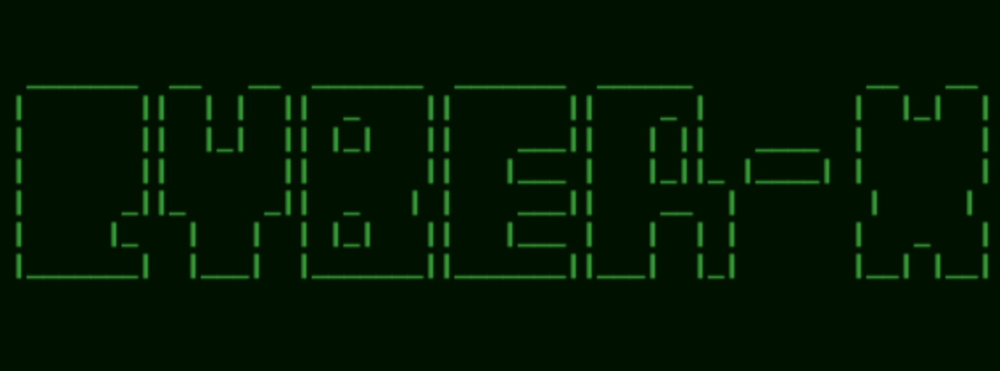

# Cyber-X

<p align="center">
Cyber ​​Equipment for Carrying out Pentesting and Server Defense from Hacker Attack Activities
  </details>

## Instalations
```
$ apt-get install python3
$ apt-get install git
$ apt install nmap 
$ apt install figlet
$ apt install jq
$ git clone https://github.com/Whomrx666/Cyber-X
```
## Installation for X-pentest
```
$ cd Cyber-X/X-pentest
$ python3 main.py
```
## Installation for X-defence
```
$ cd Cyber-X/X-defence
$ python3 setup.py
```
## Installation for X-admin
```
$ cd Cyber-X/X-defence
$ python3 admin_control.py
```

# X-pentest


# X-defence


# X-admin


## Instructions
- **first**: Install tools according to the instructions above
- **second**: Choose one tool according to your needs
- **third**: Use tools according to instructions
- **last**: The tools will automatically carry out the program according to what you want

# All menu
| Features | ✔️ |
|--------|--------|
| **Phone Number InformationVulnerability Scanner + Auto Exploit Vulnerability** |✔️ |
| **Exploit SSRF Otomatis [Support SSL]** |✔️ |
| **Bypass 403 (Bypass Forbidden Page)** |✔️ |
| **Pencari Parameter (Mining URLS)** |✔️ |
| **Temporary Email (anonim-kit)** |✔️ |
| **MetaData Cleaner (anonim-kit) [Linux Only]** |✔️ |
| **Subdomain Scanner** |✔️ |
| **Honeypot** |✔️ |
| **Vulnerability Scanner Di Server** |✔️ |
| **WAF Level Aplikasi (ModSecurity)** |✔️ |
| **Anti Virus** |✔️ |
| **Hardening Server Apache2** |✔️ |
| **Auto Ban IP (jika Percobaan terus menerus gagal)** |✔️ |
| **Anti DDOS** |✔️ |
| **Bypass captcha** |✔️ |
---------

## Observation
This is a tool for education only, I am not responsible for any misuse
### Original Author
<a href="https://github.com/Whomrx666"></a>

### <<< If you copy , Then Give me The Credits >>>

## CONNECT WITH ME :

[](https://whomrxhackers.blogspot.com/)
[](https://twitter.com/whomrx666)
[](https://youtube.com/@whomrx666)
[](https://facebook.com/https://www.facebook.com/whomrx.666)
[](https://t.me/@Whomr_X)
[](mailto:whomrx666@gmail.com)
[](https://www.tiktok.com/@whomr.x)

**If you want to donate, click on the button**
<a href="https://saweria.co/whomrx"></a>

### Visitors :

